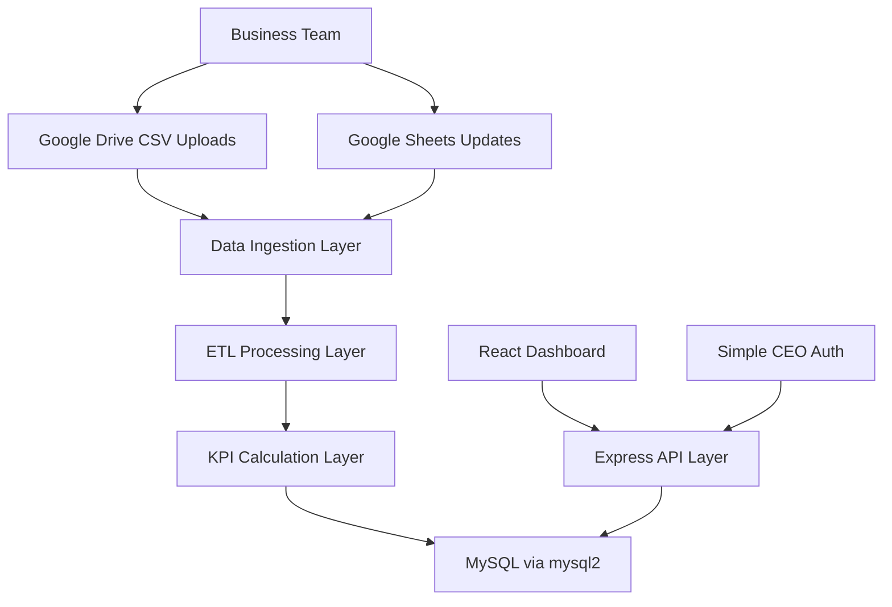

# CEO Command Center

CEO Command Center is a Phase 1 MVP web dashboard for CEO-level KPI monitoring. It consolidates business data from Google Drive CSV files and Google Sheets, runs ETL and KPI calculations in a Node.js backend, stores processed KPI snapshots in MySQL through direct `mysql2` access, and displays an executive React dashboard.

## Phase 1 Scope

Included: single CEO login, six KPI cards, Google Drive/Sheets ingestion, ETL processing logs, KPI snapshots, and executive dashboard UI.

Excluded: drill-down reports, attendance, workflow management, department management, employee management, forecasting, AI, alerts, mobile app, and multi-user role management.

## Local Setup

1. Copy `.env.example` to `.env` and update secrets.
2. Install dependencies: `npm install`.
3. Start MySQL: `docker compose up -d mysql`.
4. Create the configured database with the single MySQL user: `npm run db:create`.
5. Create tables: `npm run db:schema`.
6. Seed default data: `npm run db:seed`.
7. Start the app: `npm run dev`.

You can also run `npm run db:setup` after MySQL is running to execute database creation, table creation, and seed data in order using the same configured MySQL user.

The frontend runs on `http://localhost:5173` and the API runs on `http://localhost:4000`.

## Business Rule Baseline

See `docs/business-rules.md` and `docs/source-mapping.md` before connecting real company files.

## Database Access

The backend uses `mysql2/promise` with a centralized connection pool in `server/src/db/mysql.ts`. SQL setup scripts live in `server/sql/`, and repository modules under `server/src/repositories/` contain all raw SQL queries.

